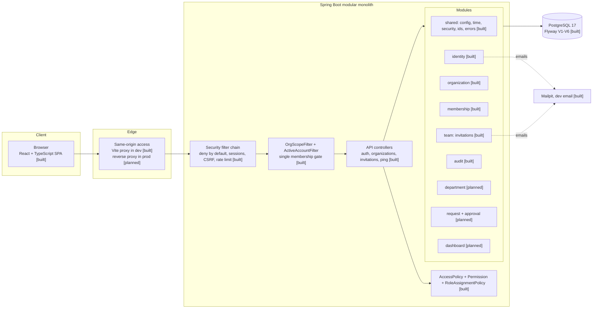

# Architecture

Status legend: **[built]** exists today, **[planned]** defined by the design but not implemented yet.

## Overview

Nexus is a **modular monolith**: one Spring Boot application, one PostgreSQL database, one React single-page application. Modules are organized by business capability and communicate through application services, never through each other's repositories (see ADR-0001).

## Backend

- **Java 21, Spring Boot 4.1**, Maven, base package `com.l2c.nexus`.
- **Package by feature**: each module has `api` (controllers and DTOs), `application` (services and transactions), `domain` (business rules) and `persistence` where the separation adds value.
- **Database**: Flyway owns the schema, Hibernate runs with `ddl-auto: validate`, and `open-in-view` is disabled.
- **Configuration**: environment variables, loaded from `.env` under the `local` profile only.
- **Errors**: Problem Details (RFC 9457) [built].
- **Time**: UTC everywhere, `timestamptz` in the database, an injected `Clock` in code [built].
- **Identifiers**: UUID v7 generated by the application, including for rows written with `JdbcClient` [built].
- **Formatting**: Spotless with google-java-format (AOSP style), enforced in `mvn verify`.

### Request flow

1. **Spring Security filter chain**: session cookie authentication (ADR-0003), CSRF for unsafe methods, rate limiting on the authentication endpoints (ADR-0016), and a per-request account re-check that ends the session of a disabled or unverified account (ADR-0018).
2. **Public paths** are `/api/system/ping`, `/api/actuator/health`, and the two anonymous auth POSTs (register, verify-email). Every other path requires authentication and returns `401` (no login redirect), per ADR-0005.
3. **Tenant paths** `/api/orgs/{orgId}/**` pass through `OrgScopeFilter`. The organization id comes from the URL path **only**, and it resolves to an `ACTIVE` membership before any controller runs. No membership, an unknown organization and a malformed id all return the *same* `404` (ADR-0004, ADR-0005).
4. The controller receives the resolved organization as a `@CurrentOrg` parameter and checks a **permission** through the one policy class (ADR-0007, ADR-0019).
5. The use case runs in a single transaction using organization-scoped queries, and writes its **audit event in that same transaction** (ADR-0012, ADR-0017).

Tenant ownership is also enforced by the database: `memberships` and `departments` expose `UNIQUE (organization_id, id)`, and tenant tables reference them with composite foreign keys, so a row cannot point at another organization's member even if application code is wrong.

## Frontend

- React, TypeScript (strict, plus `noUncheckedIndexedAccess`), Vite.
- **Feature-oriented structure**: `src/app`, `src/features/<name>`, `src/shared`, `src/components/ui`.
- **Server state** with TanStack Query, **forms** with React Hook Form and Zod, **routing** with React Router.
- One API client (`apiFetch`): same-origin cookies, CSRF header for unsafe methods, typed problem-detail errors, Zod validation of responses at the boundary.
- The active organization lives in the **route** (`/orgs/:orgId/...`), never in a session or a global store (ADR-0020).
- Route guards and hidden buttons are usability only. Authorization is enforced on the server.

## Security posture

| Area | Today | Planned |
|---|---|---|
| Endpoint access | Deny by default; `401` for unauthenticated; sessions, CSRF and rate limiting built | — |
| Authentication | Session cookie, bcrypt via `DelegatingPasswordEncoder`, email verification, per-request account check | OIDC provider as a documented migration path |
| Tenant isolation | Path-scoped organization, single membership gate, organization-scoped queries, composite foreign keys, cross-tenant negative tests | Row-level security as defence in depth (Phase 8) |
| Authorization | One permission policy; role-to-permission matrix documented in [security.md](security.md) | Last-owner invariant when member management lands |
| Secrets | `.env` gitignored, placeholders in `.env.example` | Environment variables in deployment |
| CSRF / CORS | Cookie-to-header CSRF token; no CORS needed (same origin) | Review security headers |
| Audit | Append-only log written in the business transaction | Restricted database role (Phase 9) |
| Dependencies | Dependabot, `npm audit` in CI | Maven vulnerability scan |

## Quality gates

| Check | Where |
|---|---|
| Backend unit and integration tests (Testcontainers, PostgreSQL 17) | `./mvnw verify`, CI |
| Java formatting | Spotless, `./mvnw verify`, CI |
| Frontend format, lint, typecheck, tests, build | npm scripts, CI |
| Production dependency audit | `npm audit --omit=dev --audit-level=high`, CI |

## Decisions

See [docs/decisions](decisions/README.md) for the full index: modular monolith; stack and versions; session-cookie authentication; tenant isolation; disclosure policy; platform admin separation; authorization model; error and time policy; identifiers; workflow and concurrency; secret tokens; audit log design; audit recording; frontend architecture; organizations, memberships and account checks; the tenant gate and permission policy; the organization in the frontend route; and invitations.
