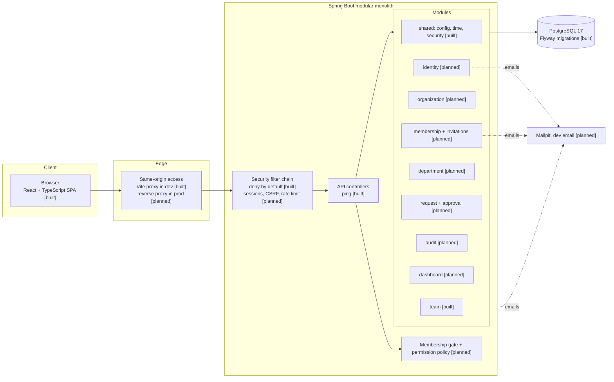

# Architecture

Status legend: **[built]** exists today, **[planned]** defined by the design but not implemented yet.

## Overview

Nexus is a **modular monolith**: one Spring Boot application, one PostgreSQL database, one React single-page application. Modules are organized by business capability and communicate through application services, never through each other's repositories (see ADR-0001).

## Backend

- **Java 21, Spring Boot 4.1**, Maven, base package `com.l2c.nexus`.
- **Package by feature**: each module has `api` (controllers and DTOs), `application` (services and transactions), `domain` (business rules) and `persistence` where the separation adds value.
- **Database**: Flyway owns the schema, Hibernate runs with `ddl-auto: validate`, and `open-in-view` is disabled.
- **Configuration**: environment variables, loaded from `.env` under the `local` profile only.
- **Errors**: Problem Details (RFC 9457) [planned].
- **Time**: UTC everywhere, `timestamptz` in the database, an injected `Clock` in code [built for the clock].
- **Formatting**: Spotless with google-java-format (AOSP style), enforced in `mvn verify`.

### Current request flow

1. A request reaches the Spring Security filter chain.
2. Only `/api/system/ping` and `/api/actuator/health` are permitted.
3. Any other path returns `401` (no login redirect), per ADR-0005.
4. Permitted requests reach their controller, which uses the injected `Clock`.

### Planned request flow for tenant data

1. Authenticate the session (cookie, ADR-0003).
2. Resolve `(user, orgId from the URL path)` to an **active membership**. No membership means `404`.
3. Check the **permission** for the action and any resource-level rule (ADR-0007).
4. Execute the use case in one transaction, with organization-scoped queries only (ADR-0004).
5. Write the audit event in the same transaction (ADR-0012).

## Frontend

- React, TypeScript (strict, plus `noUncheckedIndexedAccess`), Vite.
- **Feature-oriented structure**: `src/app`, `src/features/<name>`, `src/shared`, `src/components/ui`.
- **Server state** with TanStack Query, **forms** with React Hook Form and Zod, **routing** with React Router.
- One API client (`apiFetch`): same-origin cookies, CSRF header for unsafe methods, typed problem-detail errors, Zod validation of responses at the boundary.
- Route guards and hidden buttons are usability only. Authorization is enforced on the server.

## Security posture

| Area | Today | Planned |
|---|---|---|
| Endpoint access | Deny by default, 401 for unauthenticated | Membership gate, role permissions, resource rules |
| Secrets | `.env` gitignored, placeholders in `.env.example` | Environment variables in deployment |
| Authentication | None | Session cookie, bcrypt via DelegatingPasswordEncoder, email verification |
| CSRF / CORS | CSRF enabled by default, no CORS needed (same origin) | Cookie-to-header CSRF token |
| Tenant isolation | Schema designed for it | Path-scoped org, scoped repositories, composite foreign keys, negative tests |
| Dependencies | Dependabot, `npm audit` in CI | Maven vulnerability scan |

## Quality gates

| Check | Where |
|---|---|
| Backend unit and integration tests (Testcontainers, PostgreSQL 17) | `./mvnw verify`, CI |
| Java formatting | Spotless, `./mvnw verify`, CI |
| Frontend format, lint, typecheck, tests, build | npm scripts, CI |
| Production dependency audit | `npm audit --omit=dev --audit-level=high`, CI |

## Decisions

See [docs/decisions](decisions/README.md) for the ADRs: modular monolith, stack and versions, session authentication, tenant isolation, disclosure policy, platform admin separation, authorization model, error and time policy, identifiers, workflow and concurrency, secret tokens, audit log, frontend architecture.
