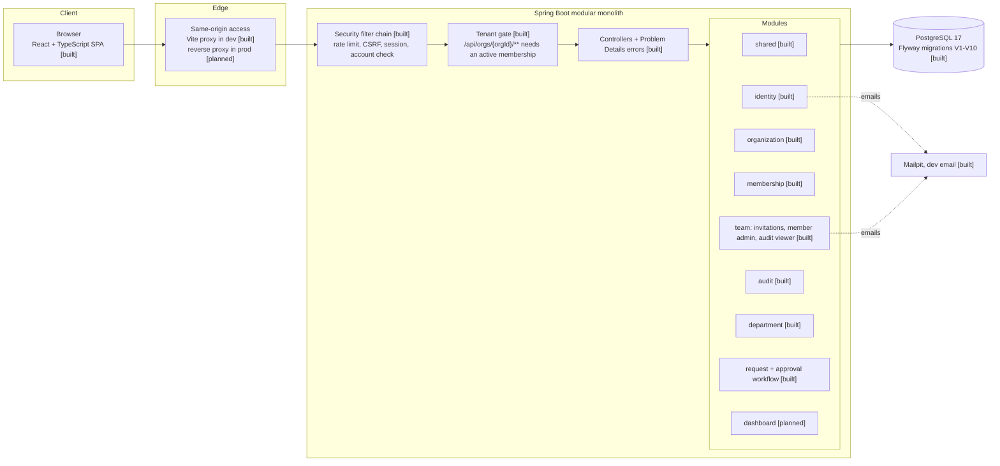
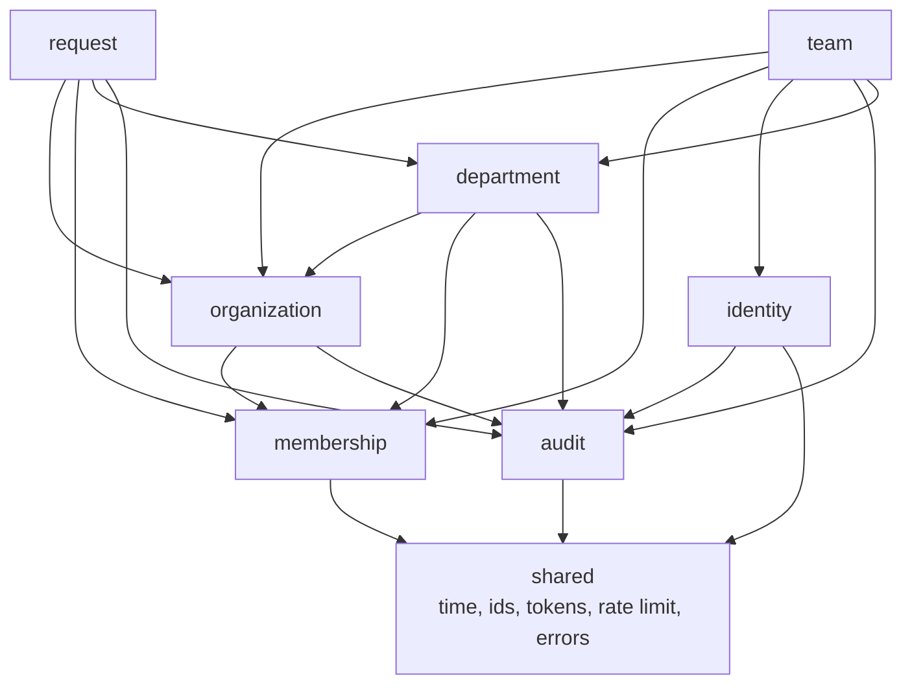

# Architecture

Status legend: **[built]** exists today, **[planned]** defined by the design but not implemented yet.

## Overview

Nexus is a **modular monolith**: one Spring Boot application, one PostgreSQL database, one React single-page application. Modules are organized by business capability and communicate through application services, never through each other's repositories (ADR-0001, ADR-0021).

## Module dependencies

Rules: arrows point at what a module may use; nothing depends on `team` or `request`. `shared` depends on no feature. Modules reach each other only through public application services (`MembershipService`, `OrganizationService`, `RequestNumberAllocator`, `DepartmentDirectory`, `UserDirectory`, `AuditService`). Documented exceptions: the organization member list, the department member list, the request list, detail and history, and the audit viewer are read-only joins over other modules' tables, because sorting and displaying names needs them (ADR-0022, ADR-0025, ADR-0026, ADR-0029).

Rules: arrows point at what a module may use; nothing depends on `team`. `shared` depends on no feature. Modules reach each other only through public application services (`MembershipService`, `OrganizationService`, `UserDirectory`, `AuditService`). One documented exception: the member list is a read-only join over memberships and users (ADR-0022). Writes always go through the owning module. Architecture tests that enforce these rules are planned for Phase 8.

## Backend

- **Java 21, Spring Boot 4.1**, Maven, base package `com.l2c.nexus`. Package by feature: `api` (controllers, DTOs), `application` (services, transactions), `domain` (entities and rules), `persistence`, plus `security`, `web` and `infrastructure` where needed.
- **Database:** 9, Hibernate runs with `ddl-auto: validate`, `open-in-view` is disabled.
- **Errors:** Problem Details (RFC 9457), including security-layer errors. Feature handlers are ordered before the global catch-all.
- **Time:** UTC everywhere, `timestamptz` in the database, an injected `Clock` in code.
- - **Concurrency:** optimistic locking (`@Version`) on mutable entities; one fixed lock order, **organization row first**, then the request or department row. The organization is locked exclusively for membership changes, department assignments and request-number allocation, and in shared mode for review decisions (so many decisions run in parallel but a role change waits for them). A shared lock on a department protects attaching it to a request; the request row is locked for transitions; atomic conditional updates protect single-use tokens and invitations.
- **Audit:** recorded in the business transaction through one service; see ADR-0017.
- **Formatting:** Spotless with google-java-format (AOSP style), enforced in `mvn verify`.

## Request flow for tenant data [built]

1. The rate-limit filter runs first for authentication endpoints.
2. Spring Security authenticates the session and validates the CSRF header on unsafe methods.
3. The active-account filter re-checks that the account is still active and verified.
4. The tenant gate resolves (user, `orgId` from the URL) to an active membership. Not a member, unknown organization or a malformed id returns the same `404`; a suspended organization returns `403` to its members.
5. The controller receives the caller's context through `@CurrentOrg`.
6. The service checks the permission (`AccessPolicy`) and resource-level rules, then runs in one transaction with organization-scoped queries only.
7. The audit event is written in the same transaction.

## Frontend

- React, TypeScript (strict, plus `noUncheckedIndexedAccess`), Vite, Tailwind CSS and shadcn/ui (Base UI primitives).
- **Feature-oriented structure:** `src/app`, `src/features/<name>` (auth, organizations, members, departments, requests, audit, system), `src/shared`, `src/components/ui`.
- **Server state** with TanStack Query (everything for one organization is cached under `["organizations", orgId, ...]`, so logout clears it), **forms** with React Hook Form and Zod, **routing** with React Router. The organization is part of the route (`/orgs/:orgId/...`).
- Shared UI and API helpers: a query-string builder, the page-envelope schema, common error wording, a pagination bar, text and textarea fields with accessible error messages, and a form-error mapper that places server field errors under their fields. Lists keep their filter state in component state; everything cached for an organization sits under one key prefix, so logout clears it.
- Permission-based controls are usability hints only. Authorization is enforced on the server.

## Quality gates

| Check | Where |
|---|---|
| Backend unit and integration tests (Testcontainers, PostgreSQL 17) | `./mvnw verify`, CI |
| Java formatting | Spotless, `./mvnw verify`, CI |
| Frontend format, lint, typecheck, tests, build | npm scripts, CI |
| Production dependency audit | `npm audit --omit=dev --audit-level=high`, CI |
| Cross-tenant isolation battery and route inventory | part of the backend test suite |

## Decisions

See [docs/decisions](decisions/README.md) for the ADRs (0001 to 0029): modular monolith, stack, session authentication, tenant isolation, disclosure policy, platform admin separation, authorization, errors and time, identifiers, workflow and concurrency, tokens, audit design and recording, frontend architecture, registration, login, rate limiting, organizations and account checks, the tenant gate, invitations, member administration, and the frontend routes and UI, departments, department assignments and service requests, and the departments and requests UI, and the workflow screens and audit viewer
