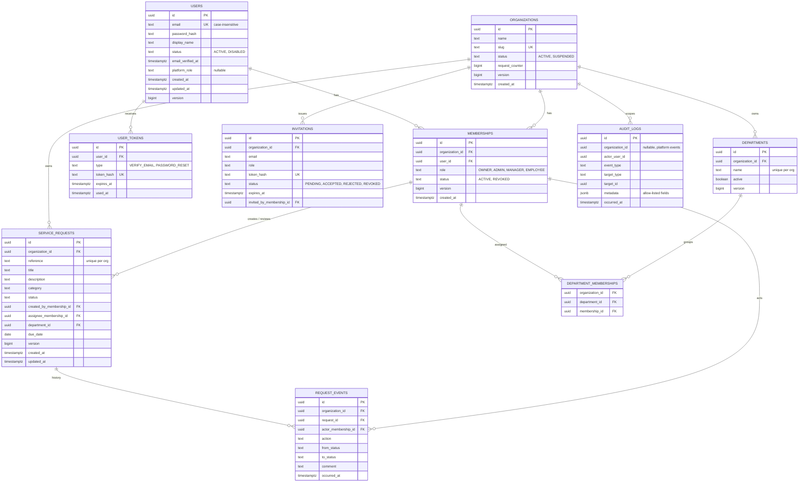

# Data model

Only the `users` table is **implemented** (Flyway `V1__create_users.sql`). The other tables are the approved design and arrive in later migrations, each with the phase that needs it.

## Entity relationship diagram (target model)

## Tables

| Table | Purpose | Status |
|---|---|---|
| `users` | Global accounts. A user is not tied to one organization. | **Implemented (V1)** |
| `user_tokens` | Single-use email verification and password reset tokens (hash only). | Planned (Phase 2) |
| `organizations` | Tenants. Holds the per-organization request counter. | Planned (Phase 3) |
| `memberships` | A user's role in one organization. One row per (organization, user). Never deleted, only `REVOKED`. | Planned (Phase 3) |
| `invitations` | Pending, accepted, rejected or revoked invitations (token hash only). | Planned (Phase 4) |
| `departments` | Organization-scoped groupings, deactivated rather than deleted. | Planned (Phase 5) |
| `department_memberships` | Assigns members to departments within one organization. | Planned (Phase 5) |
| `service_requests` | The business object that moves through the approval workflow. | Planned (Phase 5) |
| `request_events` | Append-only history of each request transition. | Planned (Phase 6) |
| `audit_logs` | Append-only security and business event trail. | Planned (Phase 6) |

## Key design decisions

**Tenant ownership is enforced by the database.** `memberships` and `departments` get `UNIQUE (organization_id, id)`. Tenant tables then reference them with **composite foreign keys**, for example `(organization_id, department_id)` and `(organization_id, created_by_membership_id)`. A row for Organization A therefore cannot reference a department or member of Organization B, even if application code is wrong (ADR-0004).

**Tenant tables reference memberships, not users.** A creator, assignee or reviewer must be a member of that organization. Because memberships are never deleted, history stays valid after a member is revoked.

**UUID primary keys** are safe to expose and not guessable (ADR-0009). Flyway owns the schema, and Hibernate only validates it.

**Audit logs have no hard foreign keys** so history outlives what it describes. The runtime database role receives INSERT and SELECT only (ADR-0012).

**Emails are unique ignoring case** through a unique index on `lower(email)`.

**Status values** are text with CHECK constraints, not database enum types, so adding a value is a simple migration.

## Constraints and indexes

Indexes are added only for a named query. Planned ones must be verified with `EXPLAIN` once realistic data exists.

| Table | Constraint or index | Justification |
|---|---|---|
| `users` | `uq_users_email_lower` on `lower(email)` | Login lookup and case-insensitive uniqueness. **Implemented.** |
| `users` | `ck_users_status`, `ck_users_platform_role` | Valid values only. **Implemented.** |
| `user_tokens` | unique `token_hash`, index `(user_id, type)` | Token lookup, and invalidating earlier tokens of the same type. |
| `organizations` | unique `slug` | Stable organization identifier in UI. |
| `memberships` | unique `(organization_id, user_id)` | No duplicate membership. |
| `memberships` | unique `(organization_id, id)` | Target of composite foreign keys. |
| `memberships` | index `(user_id)` | "Organizations available to the current user." |
| `invitations` | unique `token_hash` | Token lookup on acceptance. |
| `invitations` | index `(organization_id, status)` | List pending invitations for an organization. |
| `invitations` | index `(lower(email))` | Show a user their pending invitations. |
| `departments` | unique `(organization_id, lower(name))` | Names unique within an organization. |
| `departments` | unique `(organization_id, id)` | Target of composite foreign keys. |
| `service_requests` | unique `(organization_id, reference)` | Reference numbers unique per organization. |
| `service_requests` | index `(organization_id, status, created_at DESC)` | Request list filtering and dashboard counts. |
| `service_requests` | index `(organization_id, created_by_membership_id, created_at DESC)` | "My requests" for employees. |
| `service_requests` | index `(organization_id, assignee_membership_id)` | "Assigned to me". |
| `request_events` | index `(request_id, occurred_at)` | Request history timeline. |
| `audit_logs` | index `(organization_id, occurred_at DESC)` | Organization audit view. |

## Request reference numbers

Each organization has a counter (`organizations.request_counter`). A new request increments it atomically in the same transaction as the insert and formats the value, for example `REQ-000042`. The unique `(organization_id, reference)` constraint is the safety net if the application logic ever fails.

## Migration rules

- Files live in `backend/src/main/resources/db/migration`, named `V<number>__<description>.sql`.
- A migration that has been applied anywhere shared is **never edited**. Changes go in a new version.
- Local seed data, when added, is kept out of production migrations.
