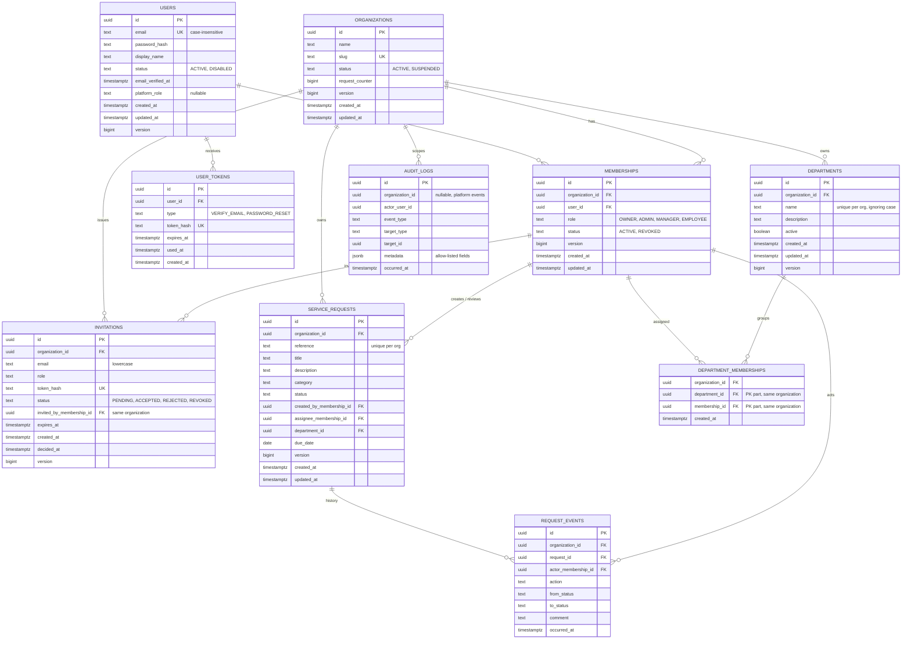

# Data model

Implemented through Flyway migrations **V1 to V11**: `users`, `user_tokens`, `spring_session`, `audit_logs`, `organizations`, `memberships`, `invitations`, `departments`, `department_memberships`, `service_requests` and `request_events`.

## Entity relationship diagram (target model)

## Tables

| Table | Purpose | Status |
|---|---|---|
| `users` | Global accounts. A user is not tied to one organization. | **Implemented (V1)** |
| `user_tokens` | Single-use email verification and password reset tokens (hash only). | **Implemented (V2)**; password reset not built |
| `spring_session`, `spring_session_attributes` | Server-side sessions (Spring Session JDBC), created by Flyway. | **Implemented (V3)** |
| `audit_logs` | `ix_audit_logs_org_time` on `(organization_id, occurred_at DESC)` | Serves the organization audit viewer: one organization's events, newest first, with date and event-type filters | Implemented |
| `organizations` | Tenants. Holds the per-organization request counter. | **Implemented (V5)** |
| `memberships` | A user's role in one organization. One row per (organization, user). Never deleted, only `REVOKED`. | **Implemented (V5)** |
| `invitations` | Pending, accepted, rejected or revoked invitations (token hash only). | **Implemented (V6)** |
| `departments` | Organization-scoped groupings, deactivated rather than deleted. | **Implemented (V7)** |
| `department_memberships` | Assigns members to departments. Composite foreign keys keep both sides in the row's organization. | **Implemented (V8)** |
| `service_requests` | The business object that moves through the approval workflow. Drafts only until the workflow phase. | **Implemented (V9)** |
| `request_events` | `ix_request_events_org_time` on `(organization_id, occurred_at DESC)` | The dashboard's recent activity: one organization's request events, newest first | Implemented (V11) |

## Key design decisions

**Tenant ownership is enforced by the database.** `memberships` exposes `UNIQUE (organization_id, id)`; tenant tables reference memberships (and later departments) with **composite foreign keys**. A row for Organization A therefore cannot reference a member of Organization B, even if application code is wrong. Live examples, each tested directly with raw SQL: `fk_invitations_inviter` (invitations), `fk_dm_department` and `fk_dm_membership` (department assignments), `fk_requests_creator`, `fk_requests_assignee` and `fk_requests_department` (service requests), and `fk_request_events_request` and `fk_request_events_actor` (request history). A NULL assignee or department simply skips its key, which is how "optional" is expressed.

**Tenant tables reference memberships, not users.** A creator, assignee or reviewer must be a member of that organization. Because memberships are never deleted, history stays valid after a member is revoked or leaves.

**UUID primary keys** (time-ordered, version 7) are safe to expose and not guessable (ADR-0009). Flyway owns the schema; Hibernate only validates it.

**Audit logs have no hard foreign keys** so history outlives what it describes. `event_type` and `target_type` have no CHECK constraint, because values are validated in code and a schema change must never make the table unwritable (ADR-0017).

**Emails are unique ignoring case** through a unique index on `lower(email)`; invitation emails are stored lowercase and checked by a constraint.

**Status values** are text with CHECK constraints, not database enum types, so adding a value is a simple migration.

**Requests:** the creator is a membership, so a request keeps its history when its creator leaves. Statuses and categories are CHECK constraints. `UNIQUE (organization_id, id)` on requests is the target for the composite key of request events. Reference numbers are unique per organization and come from the organization's counter.

**Request history:** `request_events` rows are never changed or removed (database triggers, as for the audit log), and the table has real foreign keys, because a request's history must stay attached to the request and the actor inside one organization. Unlike `audit_logs`, it holds the free-text review comments and is readable by anyone who can see the request.

**Invariants in the database, not only in code:** unique membership per user and organization; valid roles and statuses; slug format; at most one pending invitation per (organization, email) through a partial unique index; an invitation's decision time is set exactly when it is no longer pending.

## Constraints and indexes

Indexes exist only for a named query. Planned ones must be verified with `EXPLAIN` once realistic data exists.

| Table | Constraint or index | Justification | Status |
|---|---|---|---|
| `users` | `uq_users_email_lower` on `lower(email)` | Login lookup and case-insensitive uniqueness | Implemented |
| `user_tokens` | unique `token_hash`; index `(user_id, type)` | Token lookup; invalidating earlier tokens of one type | Implemented |
| `audit_logs` | `ix_audit_logs_org_time` on `(organization_id, occurred_at DESC)` | The organization audit view | Implemented |
| `organizations` | unique `slug`; slug format check | Stable readable label (never used for access) | Implemented |
| `memberships` | unique `(organization_id, user_id)` | No duplicate membership; the gate's lookup | Implemented |
| `memberships` | unique `(organization_id, id)` | Target of composite foreign keys | Implemented |
| `memberships` | `ix_memberships_user` on `(user_id)` | "Organizations available to the current user" | Implemented |
| `invitations` | unique `token_hash` | Token lookup on acceptance | Implemented |
| `invitations` | partial unique `(organization_id, email) WHERE status = 'PENDING'` | One pending invitation per person | Implemented |
| `invitations` | `ix_invitations_org_status` on `(organization_id, status, created_at DESC)` | Pending invitations of an organization | Implemented |
| `departments` | `uq_departments_org_name` on `(organization_id, lower(name))` | Unique names per organization ignoring case; also serves the listing sorted by name | Implemented |
| `departments` | unique `(organization_id, id)` | Target of composite foreign keys | Implemented |
| `department_memberships` | primary key `(department_id, membership_id)` | No duplicate assignment; "who is in this department?" | Implemented |
| `department_memberships` | `ix_dm_membership` on `(membership_id)` | "Which departments is this member in?" | Implemented |
| `service_requests` | `uq_requests_org_reference` on `(organization_id, reference)` | Reference numbers unique per organization; lookup by reference | Implemented |
| `service_requests` | `uq_requests_org_id` on `(organization_id, id)` | Target of the composite key of request events | Implemented |
| `service_requests` | `ix_requests_org_status_created` on `(organization_id, status, created_at DESC)` | Request list filtered by status; dashboard counts | Implemented |
| `service_requests` | `ix_requests_org_creator_created` on `(organization_id, created_by_membership_id, created_at DESC)` | "My requests" and the employee's restricted list | Implemented |
| `service_requests` | `(organization_id, assignee_membership_id)` | "Assigned to me" | Planned: added when that query exists |
| `request_events` | `ix_request_events_request_time` on `(organization_id, request_id, occurred_at)` | A request's history, oldest first | Implemented |

## Request reference numbers

Each organization has a counter (`organizations.request_counter`). Creating a request runs one `UPDATE ... SET request_counter = request_counter + 1 ... RETURNING` inside the creation transaction and formats the value, for example `REQ-000042`. The update locks the organization's row until the transaction ends, so concurrent creators queue up and each gets a distinct number; a rolled-back creation rolls its number back too, so there are no gaps. The unique `(organization_id, reference)` constraint is the safety net. The counter column is deliberately not mapped in the JPA entity, so entity updates never overwrite it.

## Migration rules

- Files live in `backend/src/main/resources/db/migration`, named `V<number>__<description>.sql`.
- A migration that has been applied anywhere shared is **never edited**. Changes go in a new version.
- Local seed data, when added, is kept out of production migrations.
