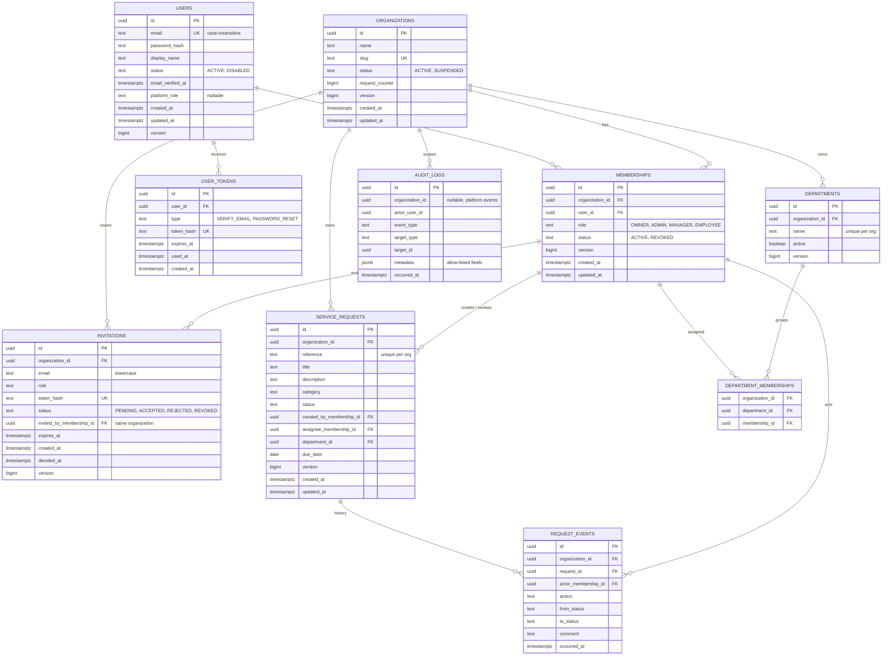

# Data model

Implemented through Flyway migrations **V1 to V6**: `users`, `user_tokens`, `spring_session`, `audit_logs`, `organizations`, `memberships`, `invitations`. Departments, requests and their history are the approved design and arrive with Phases 5 and 6.

## Entity relationship diagram (target model)

## Tables

| Table | Purpose | Status |
|---|---|---|
| `users` | Global accounts. A user is not tied to one organization. | **Implemented (V1)** |
| `user_tokens` | Single-use email verification and password reset tokens (hash only). | **Implemented (V2)**; password reset not built |
| `spring_session`, `spring_session_attributes` | Server-side sessions (Spring Session JDBC), created by Flyway. | **Implemented (V3)** |
| `audit_logs` | Append-only event trail. Triggers reject UPDATE, DELETE and TRUNCATE. No foreign keys. | **Implemented (V4)** |
| `organizations` | Tenants. Holds the per-organization request counter (not yet used). | **Implemented (V5)** |
| `memberships` | A user's role in one organization. One row per (organization, user). Never deleted, only `REVOKED`. | **Implemented (V5)** |
| `invitations` | Pending, accepted, rejected or revoked invitations (token hash only). | **Implemented (V6)** |
| `departments` | Organization-scoped groupings, deactivated rather than deleted. | Planned (Phase 5) |
| `department_memberships` | Assigns members to departments within one organization. | Planned (Phase 5) |
| `service_requests` | The business object that moves through the approval workflow. | Planned (Phase 5) |
| `request_events` | Append-only history of each request transition. | Planned (Phase 6) |

## Key design decisions

**Tenant ownership is enforced by the database.** `memberships` exposes `UNIQUE (organization_id, id)`; tenant tables reference memberships (and later departments) with **composite foreign keys**. A row for Organization A therefore cannot reference a member of Organization B, even if application code is wrong. The first live example is `fk_invitations_inviter`, which is tested directly. Departments and requests will use the same pattern.

**Tenant tables reference memberships, not users.** A creator, assignee or reviewer must be a member of that organization. Because memberships are never deleted, history stays valid after a member is revoked or leaves.

**UUID primary keys** (time-ordered, version 7) are safe to expose and not guessable (ADR-0009). Flyway owns the schema; Hibernate only validates it.

**Audit logs have no hard foreign keys** so history outlives what it describes. `event_type` and `target_type` have no CHECK constraint, because values are validated in code and a schema change must never make the table unwritable (ADR-0017).

**Emails are unique ignoring case** through a unique index on `lower(email)`; invitation emails are stored lowercase and checked by a constraint.

**Status values** are text with CHECK constraints, not database enum types, so adding a value is a simple migration.

**Invariants in the database, not only in code:** unique membership per user and organization; valid roles and statuses; slug format; at most one pending invitation per (organization, email) through a partial unique index; an invitation's decision time is set exactly when it is no longer pending.

## Constraints and indexes

Indexes exist only for a named query. Planned ones must be verified with `EXPLAIN` once realistic data exists.

| Table | Constraint or index | Justification | Status |
|---|---|---|---|
| `users` | `uq_users_email_lower` on `lower(email)` | Login lookup and case-insensitive uniqueness | Implemented |
| `user_tokens` | unique `token_hash`; index `(user_id, type)` | Token lookup; invalidating earlier tokens of one type | Implemented |
| `audit_logs` | `ix_audit_logs_org_time` on `(organization_id, occurred_at DESC)` | The organization audit view | Implemented |
| `organizations` | unique `slug`; slug format check | Stable readable label (never used for access) | Implemented |
| `memberships` | unique `(organization_id, user_id)` | No duplicate membership; the gate's lookup | Implemented |
| `memberships` | unique `(organization_id, id)` | Target of composite foreign keys | Implemented |
| `memberships` | `ix_memberships_user` on `(user_id)` | "Organizations available to the current user" | Implemented |
| `invitations` | unique `token_hash` | Token lookup on acceptance | Implemented |
| `invitations` | partial unique `(organization_id, email) WHERE status = 'PENDING'` | One pending invitation per person | Implemented |
| `invitations` | `ix_invitations_org_status` on `(organization_id, status, created_at DESC)` | Pending invitations of an organization | Implemented |
| `departments` | unique `(organization_id, lower(name))`; unique `(organization_id, id)` | Unique names per organization; composite-key target | Planned |
| `service_requests` | unique `(organization_id, reference)` | Reference numbers unique per organization | Planned |
| `service_requests` | `(organization_id, status, created_at DESC)` | Request list filtering and dashboard counts | Planned |
| `service_requests` | `(organization_id, created_by_membership_id, created_at DESC)` | "My requests" | Planned |
| `service_requests` | `(organization_id, assignee_membership_id)` | "Assigned to me" | Planned |
| `request_events` | `(request_id, occurred_at)` | Request history timeline | Planned |

## Request reference numbers (planned)

Each organization has a counter (`organizations.request_counter`, already in the table). A new request increments it atomically in the same transaction as the insert and formats the value, for example `REQ-000042`. The unique `(organization_id, reference)` constraint is the safety net.

## Migration rules

- Files live in `backend/src/main/resources/db/migration`, named `V<number>__<description>.sql`.
- A migration that has been applied anywhere shared is **never edited**. Changes go in a new version.
- Local seed data, when added, is kept out of production migrations.
